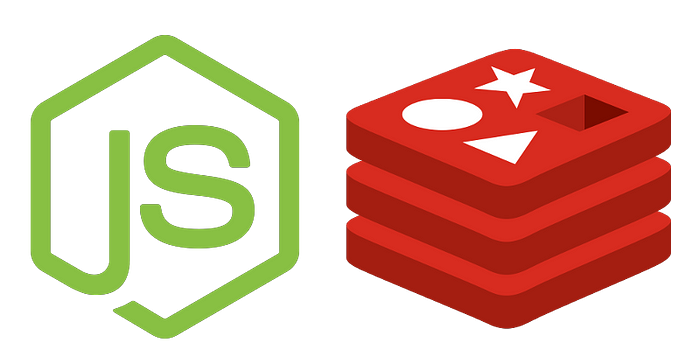

# Node.js + Redis (Cache)

This repository demonstrates how to use Redis as a caching mechanism in a Node.js application.



## Steps to Get Started

1. **Clone the Repository**  
   Run the following commands to clone the repository and navigate to the folder:  
   `git clone git@github.com:juampymdd/node-redis-cache.git`  
   `cd node-redis-cache`

2. **Install Dependencies**  
   Install the required dependencies by running:  
   `npm install`

3. **Start Redis with Docker Compose**  
   Make sure Docker is installed and running. Then, start Redis using:  
   `docker-compose up -d`

4. **Run the Application**  
   You can start the application in two modes:  

   - **Normal Mode**: `node index.js`  
   - **Watch Mode**: `node --watch index.js`

5. **Test the Application**

>**First:** When you query the endpoint, the data will be fetched from the API and stored in Redis.

>**Second:** you query the endpoint again, the data will be fetched from RedisWhen you query the endpoint again, the data will be fetched from Redis.


   - **GET Request**: get all characters.
     
     Open a browser and navigate to:  
     ```http://localhost:3000/characters```  
     You should see the response from the server.

- **GET Request**:  get a specific character.
    
    Open a browser and navigate to:  
    ```http://localhost:3000/characters/1```  
    You should see the response from the server.


    
---

### Additional Notes

- Ensure the `docker-compose.yml` file is correctly configured for Redis.  
- If you face any issues, check the logs with:  
  `docker-compose logs`
